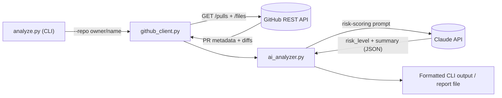
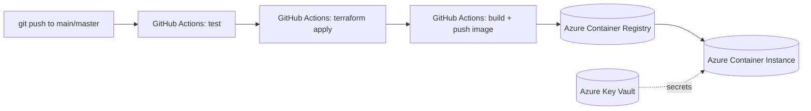

# PR Risk Analyzer


A Python CLI that fetches open pull requests from a GitHub repository and uses Claude to rate each one's risk (🟢 LOW / 🟡 MEDIUM / 🔴 HIGH) with a plain-English summary — mirroring how real DevOps teams triage incoming changes before review.

Beyond the CLI itself, this is an end-to-end DevOps build: the tool is containerized with Docker, its Azure infrastructure (Resource Group, Key Vault, Container Registry, Container Instances, Log Analytics) is provisioned with Terraform using remote state, and a GitHub Actions pipeline tests, provisions infrastructure, builds, and deploys it automatically on every push to `main`/`master`.

## Key Features

- Fetches open PRs from any accessible GitHub repo via the REST API, with automatic fallback to the Search API and graceful unauthenticated retries
- Uses Claude to classify each PR as LOW / MEDIUM / HIGH risk with a short plain-English rationale
- Configurable via CLI flags (`--repo`, `--limit`, `--output`) and environment variables, including which Claude model to use
- Dockerized for consistent, portable execution
- Full Azure deployment defined as code with Terraform — Resource Group, Key Vault, Container Registry, Container Instances, Log Analytics, remote state
- Three-stage CI/CD pipeline in GitHub Actions: test → provision infrastructure → build, push, deploy
- Unit-tested with `pytest`, coverage tracked with `pytest-cov`

## Architecture

**Runtime flow** — one GitHub call and one Claude call per PR:



**Deployment flow** — triggered on every push to `main`/`master`:



## Tech Stack

| Layer | Technology |
|---|---|
| Language | Python 3.11 |
| AI / risk scoring | Anthropic Claude API (`claude-haiku-4-5-20251001` by default) |
| Source data | GitHub REST API |
| Testing | pytest, pytest-cov |
| Containerization | Docker |
| Infrastructure as Code | Terraform (`azurerm` provider) |
| Cloud platform | Microsoft Azure (Container Instances, Container Registry, Key Vault, Log Analytics, Blob Storage) |
| CI/CD | GitHub Actions |

## Project Structure

```
pr-risk-analyzer/
├── analyze.py                  # CLI entry point
├── analyzer/
│   ├── ai_analyzer.py          # Claude risk-scoring logic
│   └── github_client.py        # GitHub REST API client
├── tests/
│   ├── test_analyzer.py        # unit tests (mocked, no network)
│   └── test_ai_integration.py  # opt-in test against the live Claude API
├── infrastructure/
│   ├── main.tf                 # Azure resources (RG, Key Vault, ACR, ACI, Log Analytics)
│   └── terraform.tfvars.example
├── .github/workflows/ci.yml    # test -> terraform apply -> build/push/deploy
├── Dockerfile
├── requirements.txt
├── pytest.ini
├── .env.example
├── NOTES.md                    # build log / learning notes behind this project
└── LICENSE
```

## Getting Started

**Prerequisites:** Python 3.11+, and an [Anthropic API key](https://console.anthropic.com/). Docker, Terraform, and an Azure subscription are only needed if you want to containerize or deploy it.

```bash
# Clone the repo
git clone https://github.com/AgentPierre/pr-risk-analyzer.git
cd pr-risk-analyzer

# Create and activate a virtual environment
python3 -m venv .venv
source .venv/bin/activate      # Windows: .venv\Scripts\activate

# Install dependencies (also includes pytest/pytest-cov, used below)
pip install -r requirements.txt

# Configure credentials
cp .env.example .env
# then edit .env with your own values
```

| Variable | Required | Description |
|---|---|---|
| `ANTHROPIC_API_KEY` | Yes | Claude API key used to score PR risk. |
| `GITHUB_TOKEN` | No | GitHub personal access token (classic or fine-grained). Raises API rate limits; public repos work without it. |
| `ANTHROPIC_MODEL` | No | Overrides the Claude model used. Defaults to `claude-haiku-4-5-20251001`. |

## Usage

```bash
# Analyze the 5 most recently updated open PRs (default)
python3 analyze.py --repo owner/repo-name

# Analyze more PRs
python3 analyze.py --repo owner/repo-name --limit 10

# Save results to a report file
python3 analyze.py --repo owner/repo-name --limit 5 --output reports/analysis.txt
```

### Example Output

```
PR #316189 — BYOK: Custom Endpoint provider
  Author       : vijayupadya
  Files changed: 9
  Additions    : +694
  Deletions    : -54
  Risk Level   : 🔴 HIGH
  Summary      : Modifies core authentication logic across 9 files.
                 Significant scope with potential for breaking changes.
```

## Running Tests

```bash
# Fast unit tests only — no network calls, no API cost (this is what CI runs)
pytest tests/ -m "not integration" --cov=analyzer --cov-report=term-missing

# Full suite, including the live Claude API integration test
pytest tests/ -v
```

`tests/test_analyzer.py` holds 5 unit tests against `parse_pr()` with no network calls. `tests/test_ai_integration.py` adds one opt-in test that calls the live Claude API — it's marked `@pytest.mark.integration`, automatically skipped unless `ANTHROPIC_API_KEY` is set, and excluded from CI via the `not integration` filter.

- **Verified with the CI command above (no API key needed):** 5/5 unit tests passing, 20% coverage on `analyzer/`.
- **With the integration test included** (requires a live `ANTHROPIC_API_KEY`, makes a real billed API call): 6/6 tests passing, with `ai_analyzer.py` reaching 100% coverage and ~46% overall, per the most recent full run recorded in [`NOTES.md`](NOTES.md).

## Docker

```bash
# Build the image
docker build -t pr-risk-analyzer .

# Run it — arguments after the image name pass straight to analyze.py
docker run --env-file .env pr-risk-analyzer --repo owner/repo-name --limit 5
```

## Infrastructure / Cloud Deployment

`infrastructure/main.tf` provisions everything needed to run the analyzer as a one-shot job on Azure: a Resource Group, a Key Vault (with an access policy for the CI service principal), an Azure Container Registry, a Container Instance (`restart_policy = "Never"` — a batch job, not an always-on service), and a Log Analytics Workspace for persisted logs. Terraform state is stored remotely in Azure Blob Storage rather than locally.

```bash
cd infrastructure
terraform init
terraform plan
terraform apply    # provisions real, billable Azure resources
```

> **Replicating the Azure deployment yourself?** A few things in `infrastructure/main.tf` are specific to the original deployment and need to change first:
> - The Container Registry name (`pranalyzeracr`) and the Terraform state storage account name (`pranalyzertfstate`) must be **globally unique across all of Azure** — pick your own.
> - The Key Vault name (`pr-analyzer-vault`) must be unique within your Azure tenant.
> - The Container Instance's `commands` currently hardcodes `python analyze.py --repo kubernetes/kubernetes --limit 5` — change this to whatever repo you want analyzed.
> - Copy `infrastructure/terraform.tfvars.example` to `infrastructure/terraform.tfvars` and fill in your own Azure `tenant_id`.

## CI/CD Pipeline

`.github/workflows/ci.yml` runs on every push and pull request to `main`/`master`:

1. **Run Tests** — always runs; installs dependencies and runs the unit suite with coverage.
2. **Terraform Apply** — only on pushes to `main`/`master` (not PRs); authenticates to Azure via a Service Principal and provisions/updates infrastructure.
3. **Build, Push, Deploy** — builds the Docker image, pushes it to Azure Container Registry, and restarts the Azure Container Instance.

To run this pipeline end-to-end from a fork, add these repository secrets: `AZURE_CREDENTIALS` (a Service Principal credential JSON) and `AZURE_TENANT_ID`.

## Security Notes

Secrets flow through three tiers depending on where the code runs:

- **Local development** — `.env` (gitignored), loaded once at the entrypoint (`analyze.py`), never inside imported modules — so importing anything under `analyzer/` never requires credentials to be present.
- **CI** — GitHub Actions repository secrets, scoped to a dedicated Service Principal rather than a personal account.
- **Production** — Azure Key Vault; secrets are injected into the container at deploy time via Terraform's `secure_environment_variables`, so they never appear in the image or in CI logs.

`.env`, `*.tfstate`, and `terraform.tfvars` should never be committed — copy `.env.example` / `infrastructure/terraform.tfvars.example` and fill in your own values instead.

## Limitations

- PRs are processed sequentially — one GitHub call and one Claude call per PR — so runtime and API cost scale linearly with `--limit`.
- The deployed Azure Container Instance currently runs a single hardcoded command as a one-shot batch job rather than an always-on or triggered service.
- Dependencies in `requirements.txt` are unpinned (no lockfile).

## License

Released under the [MIT License](LICENSE).

---

Built by [AgentPierre](https://github.com/AgentPierre) — see [`NOTES.md`](NOTES.md) for the full build log and learning notes behind this project.
